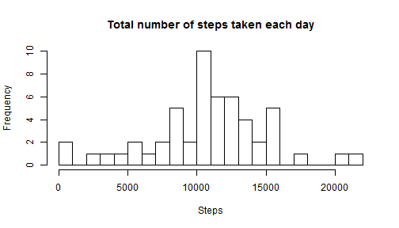
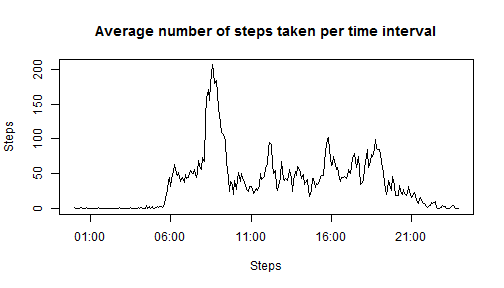
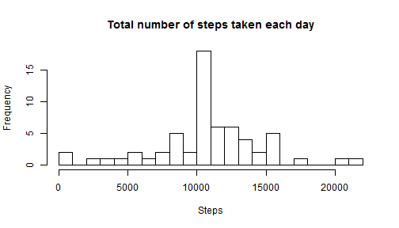
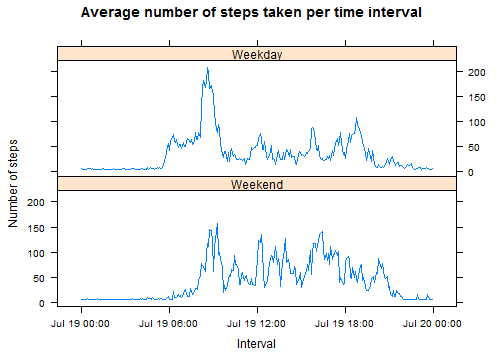

## Introduction  

This assignment makes use of data from a personal activity monitoring device. This device collects data at 5 minute intervals through out the day. The data consists of two months of data from an anonymous individual collected during the months of October and November, 2012 and include the number of steps taken in 5 minute intervals each day.  

### About the data  

The data for this assignment can be downloaded from the course web site:  
- **Dataset**: Activity monitoring data [52K]  

The variables included in this dataset are:  
- **steps**: Number of steps taking in a 5-minute interval (missing values are coded as NA)  
- **date**: The date on which the measurement was taken in YYYY-MM-DD format  
- **interval**: Identifier for the 5-minute interval in which measurement was taken  

The dataset is stored in a comma-separated-value (CSV) file and there are a total of 17,568 observations in this dataset.  


## Analysis  


### Loading and preprocessing the data  

The data for this study can be downloaded from [here] (https://d396qusza40orc.cloudfront.net/repdata%2Fdata%2Factivity.zip). Below R code will download the file into a local zip file (activity.zip).  


```r
download.file ("https://d396qusza40orc.cloudfront.net/repdata_data_activity.zip", "activity.zip", method="curl")
```

#### Loading the data  

The activity data is loaded into a dataframe "activityRawData" using read.csv()  


```r
unzip("activity.zip")
activityRawData <- read.csv("activity.csv")
```

The first 5 observations are shown below:  

```
##   steps       date interval
## 1    NA 2012-10-01        0
## 2    NA 2012-10-01        5
## 3    NA 2012-10-01       10
## 4    NA 2012-10-01       15
## 5    NA 2012-10-01       20
```

#### Processing the data  

"interval" field is a numeric representation of the 5 minute window time of the day. Use this field to create a new variable called "time", by converting the numeric value into "HH:MM" format.  


```r
activityRawProcessedData <- cbind(activityRawData, time=strptime(activityRawData$interval+10000, format="1%H%M"))
```

Here are the first 5 records with the new variable.  


```
##   steps       date interval                time
## 1    NA 2012-10-01        0 2015-07-19 00:00:00
## 2    NA 2012-10-01        5 2015-07-19 00:05:00
## 3    NA 2012-10-01       10 2015-07-19 00:10:00
## 4    NA 2012-10-01       15 2015-07-19 00:15:00
## 5    NA 2012-10-01       20 2015-07-19 00:20:00
```


### Mean total number of steps taken per day  

#### Calculate the total number of steps taken per day  

Following R code calculates the total steps taken per day. The missing values in the dataset (NAs) are ignored at this stage.  


```r
stepsPerDay <- ddply(activityRawProcessedData[complete.cases(activityRawProcessedData),], .(date), summarize, avg_steps=sum(steps))

names(stepsPerDay) <- c("Date","Steps")
```


#### Histogram of the total number of steps taken each day  

 


#### Mean and Median of the total number of steps taken per day  

R code to calculate the Mean and Median of the total steps taken per day.  


```r
meanTotalDailySteps <- mean(stepsPerDay$Steps)
medianTotalDailySteps <- median(stepsPerDay$Steps)
```

Mean of the total number of steps taken each day: **10766.19**  
Medean of the total number of steps taken each day: **10765**  
 
 
### Average daily activity pattern  
 
#### Time series plot of the 5-minute interval (x-axis) and the average number of steps taken, averaged across all days (y-axis)  

R code to calculate the average steps taken per time interval.  

```r
meanStepsPerInterval <- ddply(activityRawProcessedData[complete.cases(activityRawProcessedData),], .(time), summarize, avg_steps=mean(steps))

names(meanStepsPerInterval) <- c("Interval","Steps")
```

Time plot:

 


#### Finding the 5-minute interval containing maximum average number of steps.  

R code to calculate the max interval.  

```r
maxSteps <- max(meanStepsPerInterval$Steps)
maxInterval <- meanStepsPerInterval[meanStepsPerInterval$Steps == maxSteps, 1]
```

The 5 minute interval with maximum number of steps is **08:35**  


### Imputing missing values  
 
There are a number of days/intervals where there are missing values (coded as NA). The presence of missing days may introduce bias into some calculations or summaries of the data. So we will impute the missing values with precalculated values.  

For this assignment, the strategy used will be to impute the missing values with the mean of that 5-minute interval.  

#### Finding the total number of missing values in the dataset  

Below code gives the count of missing values.

```r
activityNA <- activityRawProcessedData[is.na(activityRawProcessedData$steps),]

totalNARows <- dim(activityNA)[1]
```

There are **2304** missing values in the dataset.  

#### Create a new dataset by imputing missing values with the mean of the interval.  

Below R code imputes the missing values.  

```r
activityImputedData <- activityRawProcessedData %>%
  group_by(interval) %>%
  mutate(steps = ifelse(is.na(steps), 
                         mean(steps, na.rm = TRUE), 
                         steps))
```
 
#### Histogram of the total number of steps taken each day  

R code to calculate the total steps taken for each day, using the imputed data.  

```r
stepsPerDayImputed <- ddply(activityImputedData, .(date), summarize, total_steps=sum(steps))

names(stepsPerDayImputed) <- c("Date","Steps")
```

 


R code to calculate the mean and median total number of steps taken per day using the imputed data.  


```r
meanStepsPerDayImputed <- mean(stepsPerDayImputed$Steps)
medianStepsPerDayImputed <- median(stepsPerDayImputed$Steps)
```

After imputing missing values:  
Mean steps per day: **10766.19**  
Median steps per day: **10766.19**  

Before imputing missing values (calculated earlier)  
Mean steps per day: **10766.19**  
Medean steps per day: **10765**  


### Activity patterns between weekdays and weekends  

#### Creating a new factor variable in the dataset with two levels -"weekday" and "weekend"€� indicating whether a given date is a weekday or weekend day.


```r
activityFactoredData <- mutate(activityImputedData, day=wday(activityImputedData$date, label=TRUE, abbr=FALSE))

activityFactoredData$WeekendFactor <- factor((activityFactoredData$day %in% c('Saturday', 'Sunday')), levels=c(TRUE, FALSE), labels=c('Weekend', 'Weekday'))
```

First 10 rows with the new factor variable "WeekendFactor".  

```
## Source: local data frame [10 x 6]
## Groups: interval
## 
##      steps       date interval                time    day WeekendFactor
## 1  37.3826 2012-10-01        0 2015-07-19 00:00:00 Monday       Weekday
## 2  37.3826 2012-10-01        5 2015-07-19 00:05:00 Monday       Weekday
## 3  37.3826 2012-10-01       10 2015-07-19 00:10:00 Monday       Weekday
## 4  37.3826 2012-10-01       15 2015-07-19 00:15:00 Monday       Weekday
## 5  37.3826 2012-10-01       20 2015-07-19 00:20:00 Monday       Weekday
## 6  37.3826 2012-10-01       25 2015-07-19 00:25:00 Monday       Weekday
## 7  37.3826 2012-10-01       30 2015-07-19 00:30:00 Monday       Weekday
## 8  37.3826 2012-10-01       35 2015-07-19 00:35:00 Monday       Weekday
## 9  37.3826 2012-10-01       40 2015-07-19 00:40:00 Monday       Weekday
## 10 37.3826 2012-10-01       45 2015-07-19 00:45:00 Monday       Weekday
```

#### Time series plot of the 5-minute interval (x-axis) and the average number of steps taken, averaged across all weekday days or weekend days (y-axis).  

R code to calculate the average number of steps per time interval and factor.  

```r
activityFinalData <- ddply(activityFactoredData, .(time, WeekendFactor), summarize, avg=mean(steps))
```

Panel plot:  
 

Based on the plot we can observe that during weekends there is more activity from 12:00 noon and 18:00 hrs when compared with weekdays.  

This concludes the analysis.  

Thank you!  

